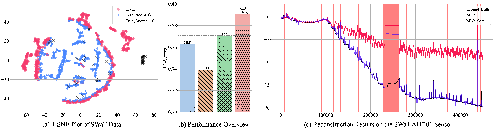

# M2N2 (When Model Meets New Normals)

Official repository for the paper
"When Model Meets New Normals: Test-time Adaptation for Unsupervised Time-series Anomaly Detection", Under Review.

Arxiv Preprint: [Link]()

## News
- [20230900] We have decided to release our paper at arxiv, and the code repo.

## About Our Work
Time-series Anomaly Detection (TSAD) deals with the problem of detecting anomalous timesteps,
by learning "normalities" from the sequence of observations.

Our research starts from the question:

> "Is it possible that the concept of normality be changed over time?"

We have observed that in time-series anomaly detection task, 
distribution shift of the concept of normalities naturally occurs, 
which poses a significan challenge in modeling time-series anomaly detection.



We call this problem as "New-normal problem", 
and shows that simple normalization strategy along with model update can handle this probelm effectively.

## About the dataset
All datasets are assumed to be in "data" folder. 

1. **NeurIPS-TS** NeurIPS-TS dataset are created using the principles in https://openreview.net/forum?id=r8IvOsnHchr.
We prepared Univariate/Multivariate dataset, for each data length being 1000.
For data generation, please refer to [univariate_generator](https://github.com/carrtesy/DeepTSAD/blob/master/data/univariate_generator.py), [multivariate_generator](https://github.com/carrtesy/DeepTSAD/blob/master/data/multivariate_generator.py).

SWaT and WADI dataset has two types of data: train (normal) and test (abnormal).
Train set does not contain anomaly set. Test set has anomalies driven by researcher's attack scenarios.
Request via guidelines in the [link](https://itrust.sutd.edu.sg/itrust-labs_datasets/dataset_info/).

2. **SWaT (2022-10-25)** : Secure Water Treatment Dataset
- With shared google drive link after request, refer to *SWaT.A1 & A2_Dec 2015*
- For Normal Dataset, refer to ./Physical/SWaT_Dataset_Normal_v0.xlsx
- For Attack Dataset, refer to ./Physical/SWaT_Dataset_Attack_v0.xlsx
- convert xlsx using *read_xlsx_and_convert_to_csv* in utils/tools.py

3. **WADI (2022-10-25)** : Water Distribution Dataset
- With shared google drive link after request, refer to *WADI.A2_19 Nov 2019*
- For Normal Dataset, refer to ./WADI_14days_new.csv
- For Attack Dataset, refer to ./WADI_attackdataLABLE.csv

4. **SMD**: Server Machine Dataset
- Download: https://github.com/NetManAIOps/OmniAnomaly/ServerMachineDataset directory

5. **MSL and SMAP**
- Download with instructions from: https://github.com/khundman/telemanom
```bash
curl -O https://s3-us-west-2.amazonaws.com/telemanom/data.zip && unzip data.zip && rm data.zip
````

6. **CreditCard**
- https://www.kaggle.com/datasets/mlg-ulb/creditcardfraud
- As a reference, take a look at: https://fraud-detection-handbook.github.io/fraud-detection-handbook/Chapter_3_GettingStarted/SimulatedDataset.html

7. **Yahoo**
- request to: https://webscope.sandbox.yahoo.com/

## Options

set threshold to offline best f1 score
``` 
python test.py (...) infer_options=["offline"] thresholding=off_f1_best
```

run all thresholds in range(a, b, c)

``` 
python test.py (...) infer_options=["offline_all"] +qStart=0.90 +qEnd=1.00 +qStep=0.01
```

save run information
```
plot_anomaly_scores: False
plot_recon_status: False
save_result: True # save result in pandas dataframe
load_anoscs: True # load previously calcuated anomaly score (if not exist, start from scratch.)
save_outputs: False # gt (X.pt) and reconstructed (Xhat.pt)
save_roc_curve: False # whether to save fpr, tpr, thrs from sklearn.roc_curve
```
